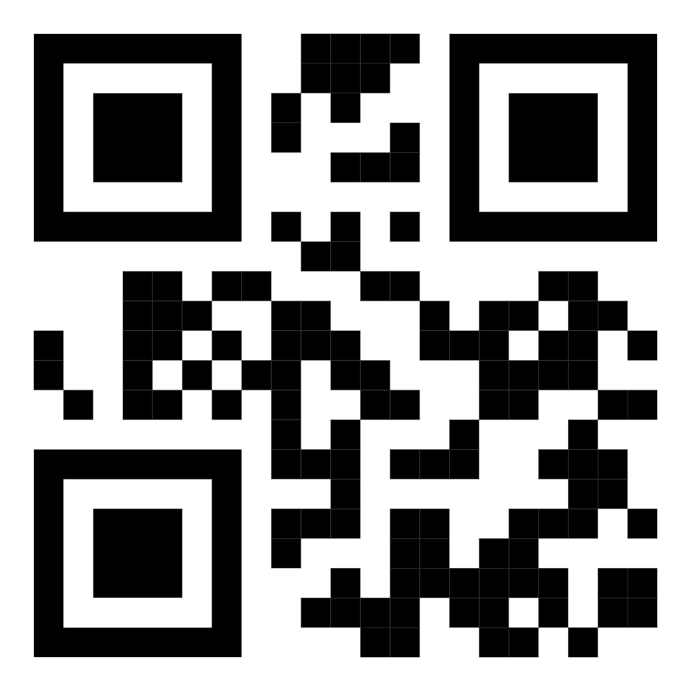
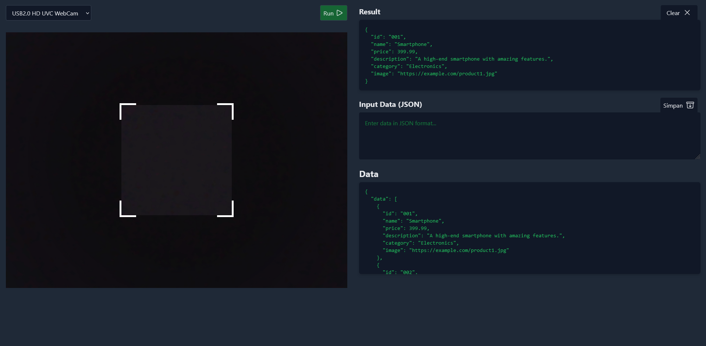

# QRCode Scanner Reader NodeJS

Testing Scanner Reader Tools Like Cashiers

### Example Data
```
[
  {
    "id": "001",
    "name": "Smartphone",
    "price": 399.99,
    "description": "A high-end smartphone with amazing features.",
    "category": "Electronics",
    "image": "https://example.com/product1.jpg"
  },
  {
    "id": "002",
    "name": "Laptop",
    "price": 899.99,
    "description": "A lightweight laptop for work and play.",
    "category": "Computers",
    "image": "https://example.com/product2.jpg"
  },
  {
    "id": "003",
    "name": "Wireless Headphones",
    "price": 59.99,
    "description": "Noise-canceling wireless headphones.",
    "category": "Accessories",
    "image": "https://example.com/product3.jpg"
  }
]
```

> `id` : required. others data optional

### QRCode Example



### Screenshoot

